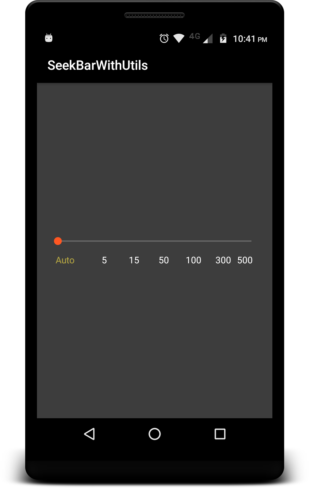
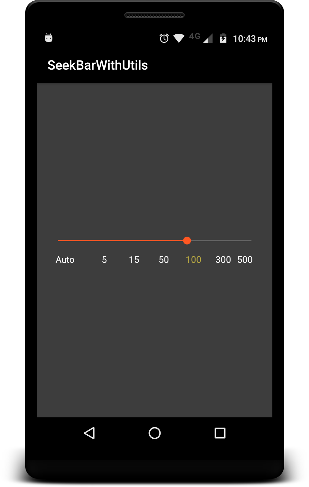

# SeekBarWithIntervals
This is SeekbarWithIntervals - an extension of the Seekbar with labels
 Seekbar with labelled intervals  Like Olx, SeekBar
 
# Screen Shot
  

#Thanks to
https://www.informaticscentre.co.uk/blog/implementing-a-seekbar-with-stepped-intervals-in-android

## License
```
MIT License

Copyright 2016 Ramesh Bhupathi

Licensed under the Apache License, Version 2.0 (the "License");
you may not use this file except in compliance with the License.
You may obtain a copy of the License at

   http://www.apache.org/licenses/LICENSE-2.0

Unless required by applicable law or agreed to in writing, software
distributed under the License is distributed on an "AS IS" BASIS,
WITHOUT WARRANTIES OR CONDITIONS OF ANY KIND, either express or implied.
See the License for the specific language governing permissions and
limitations under the License.
